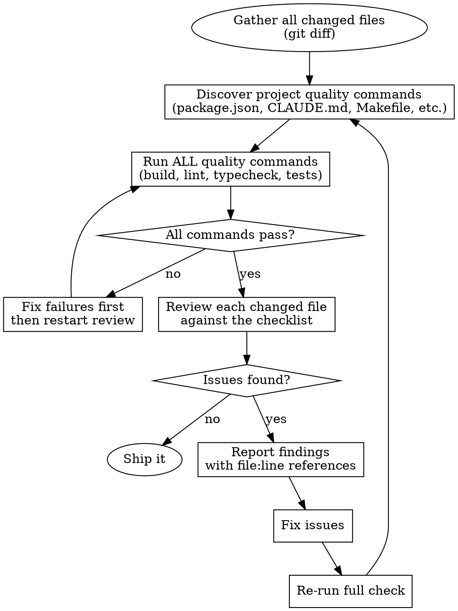

# Ship Check

A brutally honest self-review of YOUR OWN changes before they ship. You wrote the code — now grill yourself like a senior engineer reviewing a junior's PR. No hand-waving, no "it should be fine", no skipping checks.

## Core Principle

**You are not allowed to be nice to yourself.** Every change you made is suspect until proven otherwise. The goal is catching problems NOW, not in production at 2am.

## When to Use

- After completing any implementation task, before committing
- After a bugfix, to verify you didn't introduce new issues
- After a refactor, to verify behavior is preserved
- When the user asks "is this ready?" or "check my work"
- Before creating a PR

## When NOT to Use

- Mid-implementation (you're still writing code)
- For reviewing someone else's PR (use code-review skill instead)
- For initial exploration or planning

## The Review Process



### Step 1: Gather Your Changes

Get the full picture of what you changed:

```bash
# Staged + unstaged changes
git diff HEAD --name-only

# If nothing staged, check working tree
git diff --name-only

# See the actual diff for review
git diff HEAD
```

Only review files YOU changed. Don't review the entire codebase — that's noise. But DO read surrounding context in changed files to understand impact.

### Step 2: Discover and Run Quality Commands

Before you review a single line of code, find and run every quality check the project has. Look in these places:

- **package.json** → `scripts` section (look for: `quality`, `lint`, `build`, `type-check`, `test`, `test:run`, `format:check`)
- **CLAUDE.md / README.md** → documented commands for quality checks
- **Makefile** → `check`, `lint`, `test`, `build` targets
- **pyproject.toml** → tool configurations (pytest, mypy, ruff, black)
- **Cargo.toml** → `cargo clippy`, `cargo test`
- **CI config** (`.github/workflows/`, `.gitlab-ci.yml`) → what CI runs, you should run too

Run them ALL. If any fail, fix failures before proceeding to the code review. There is no point reviewing code that doesn't build or pass lint.

### Step 3: Review Each Changed File

For every file you touched, check against this list. Be specific — cite `file_path:line_number` for every issue.

#### Production Safety

- **Will this break existing functionality?** Trace every function/component you modified — who calls it? What depends on it? Did you change a return type, parameter order, or default value that callers rely on?
- **Error handling** — Did you add proper error handling for new code paths? Not generic `catch(e) { console.log(e) }` but specific, actionable error handling.
- **Edge cases** — What happens with null, undefined, empty arrays, empty strings, zero, negative numbers? What about concurrent access?
- **Resource cleanup** — Did you add any listeners, intervals, subscriptions, connections? Are they cleaned up?
- **Environment differences** — Will this work in production, not just dev? Different configs, missing env vars, different data volumes?

#### Code Quality

- **Duplications** — Did you write something that already exists elsewhere in the codebase? Search for similar function names, patterns, utilities. BUT: only flag as duplication if you're CERTAIN. Similar-looking code that handles different edge cases or operates on different types is NOT duplication. Read both implementations fully before claiming duplication.
- **God files** — Did any file you modified grow beyond ~300 lines? Does it now handle multiple unrelated concerns? If so, split it.
- **Separation of concerns** — Is business logic mixed with UI? Data fetching mixed with rendering? Validation inside API handlers? Each file/function should do ONE thing.
- **Dead code** — Did you leave any unused imports, variables, functions, or commented-out code? Remove them.
- **Magic values** — Any hardcoded strings, numbers, or URLs that should be constants or config?
- **Naming** — Do new names follow existing conventions? Are they descriptive? Consistent with the rest of the codebase?

#### Simplification

- **Over-engineering** — Did you add abstractions nobody asked for? Factory patterns where a function works? Config options for one use case? Remove them.
- **Unnecessary complexity** — Can any function be simplified without losing behavior? Are there nested ternaries, deeply nested if/else chains, or overly clever one-liners that hurt readability?
- **Redundant code** — Are there multiple similar code paths that could be unified? BUT again — only if they're truly redundant, not just superficially similar.

#### File & Folder Structure

- **New files in the right place?** — Follow the project's existing directory conventions. Don't create new directories when an existing one fits.
- **Consistent patterns** — Does the new code follow the same patterns as neighboring files? Same export style, same hook patterns, same error handling approach?
- **File size** — Keep files under ~300 lines. If you created a new file that's already large, it probably needs splitting.

### Step 4: Report Findings

Be specific and actionable. For each issue:

```
[SEVERITY] file_path:line_number - Description of the issue
  → Suggested fix
```

Severity levels:
- **BLOCKER** — Will break production or existing functionality. Must fix.
- **WARNING** — Code smell, potential issue, or violation of project conventions. Should fix.
- **SUGGESTION** — Could be better but not harmful. Nice to fix.

### Step 5: Fix and Re-verify

After fixing issues, re-run the full check from Step 2. Don't trust that your fix didn't introduce new problems. The review cycle ends when:
- All quality commands pass
- No BLOCKERs or WARNINGs remain
- You can honestly say "I'd approve this PR if someone else wrote it"

## Red Flags — Be Honest With Yourself

If you catch yourself thinking any of these, STOP:

| Thought | Reality |
|---------|---------|
| "This is good enough" | Good enough for whom? Check every item. |
| "It works, so it's fine" | Working code can still be bad code. Review quality. |
| "I'll clean it up later" | Later never comes. Clean it now. |
| "It's just a small change" | Small changes cause production outages. Review it. |
| "The tests pass" | Tests only catch what they test. Review what they don't. |
| "Nobody will notice" | Production will notice. Users will notice. |
| "I already reviewed it while writing" | You were in building mode, not review mode. Different mindset. |
| "This file was already messy" | Don't make it messier. Leave it better than you found it. |

## The Brutal Honesty Test

Before declaring "ship it", answer these honestly:

1. If a senior engineer reviewed this PR tomorrow, would they approve it without comments?
2. If this change caused a production incident, could you defend every line?
3. Did you actually READ every line of your diff, or did you skim?
4. Are you rushing because you want to be done, or because the code is actually ready?

If any answer makes you uncomfortable, you're not done yet.
