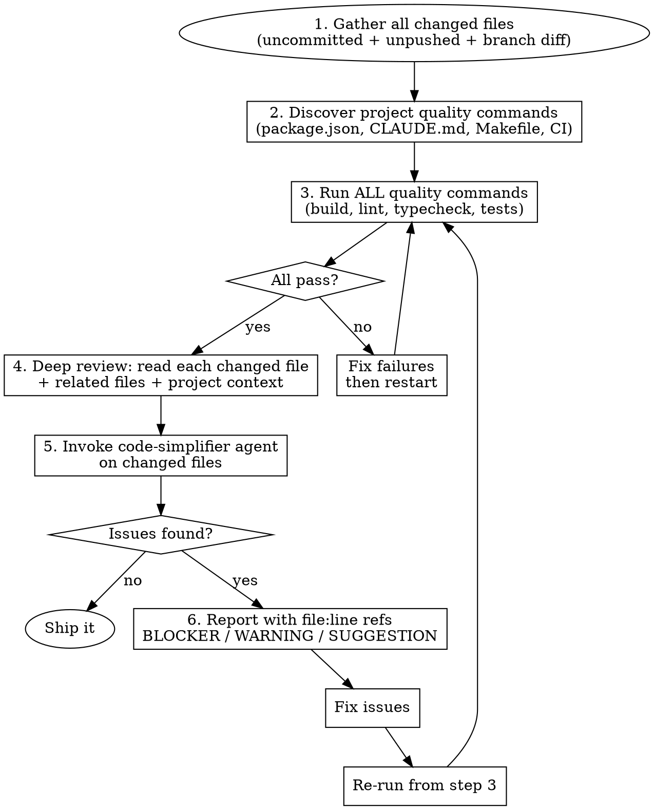

# Ship-Wreck Check

You wrote the code — now tear it apart like a senior engineer reviewing a junior's PR. No hand-waving, no "it should be fine", no skipping steps. The name says it all: catch the wreck before it ships.

## Core Principle

**You are not allowed to be nice to yourself.** Every change you made is suspect until proven otherwise. The goal is catching problems NOW — not discovering them in production.

## The Review Process



### Step 1: Gather Your Changes

Get the full picture of what changed. Changes can live in multiple places — check ALL of them:

```bash
# Uncommitted changes (staged + unstaged)
git diff HEAD --name-only

# If working tree is clean, check unpushed commits
# (user may have already committed but not pushed)
git log --name-only --oneline origin/$(git branch --show-current)..HEAD

# If both are empty, check the main branch diff
# (user may be on a feature branch with all changes committed)
git diff --name-only main...HEAD
```

The key insight: "check my work" doesn't always mean uncommitted changes. The user might have committed already, or be on a feature branch. Cast a wide net — find ALL the changes that are part of the current work, wherever they live.

Only review files that are part of the current work — but read surrounding context and related files to understand impact.

### Step 2: Discover Project Quality Commands

Before reviewing a single line, find every quality check the project defines. Scan these locations:

- **package.json** → `scripts` section (`quality`, `lint`, `build`, `type-check`, `test`, `test:run`, `format:check`)
- **CLAUDE.md / README.md** → documented commands, "before committing" sections, quality check instructions
- **Makefile** → `check`, `lint`, `test`, `build` targets
- **pyproject.toml** → pytest, mypy, ruff, black configs
- **Cargo.toml** → `cargo clippy`, `cargo test`
- **CI config** (`.github/workflows/`, `.gitlab-ci.yml`) → whatever CI runs, you run too

Read these files. If they say "run X before committing", run X.

### Step 3: Run ALL Quality Commands

Run every command you discovered. If any fail, fix the failures before proceeding to the code review. There is zero point reviewing code that doesn't build or pass lint.

### Step 4: Deep Review — Understand What You Changed

This is the heart of the review. For every changed file, truly understand it — don't skim.

**Read each changed file fully.** Then read the files that depend on it and the files it depends on. Understand the ripple effects. Use Grep and Glob to find callers, importers, and related code.

#### Production Safety

- **Will this break callers?** Trace every function/component you modified. Who calls it? Did you change a return type, parameter order, or default value that callers rely on?
- **Error handling** — Proper handling for new code paths? Not generic `catch(e) { console.log(e) }` — specific, actionable errors with proper propagation.
- **Edge cases** — What happens with null, undefined, empty arrays, empty strings, zero, negative numbers? Concurrent access?
- **Resource cleanup** — Any new listeners, intervals, subscriptions, connections? Are they cleaned up on unmount/disconnect/error?
- **Environment differences** — Will this work in production? Different configs, missing env vars, different data volumes, different permissions?

#### Code Quality

- **Duplications** — Did you write something that already exists in the codebase? Search for similar function names and patterns. BUT: only flag as duplication if you are CERTAIN after reading both implementations fully. Similar-looking code that handles different edge cases or types is NOT duplication. When in doubt, it's not a duplication.
- **God files** — Did any file grow beyond ~300 lines or handle multiple unrelated concerns? Split it.
- **Separation of concerns** — Business logic mixed with UI? Data fetching in components? Validation inside handlers? Each file/function does ONE thing.
- **Dead code** — Unused imports, variables, functions, commented-out blocks? Remove them.
- **Magic values** — Hardcoded strings, numbers, URLs that should be constants or config?
- **Naming** — Do new names follow existing project conventions? Are they descriptive and consistent?

#### File & Folder Structure

- **New files in the right place?** Follow the project's existing directory conventions.
- **Consistent patterns** — Same export style, hook patterns, error handling approach as neighboring files?
- **File size** — New file already large? Probably needs splitting.

### Step 5: Invoke the Code-Simplifier Agent

After your manual review, dispatch the `code-simplifier` agent (available as the `simplify` skill) on the changed files. It provides a focused second pair of eyes on:

- Unnecessary complexity and nesting
- Redundant code paths that can be consolidated
- Variable/function names that could be clearer
- Overly clever one-liners that hurt readability
- Inconsistencies with project coding standards
- Over-engineering (abstractions nobody asked for, factory patterns where functions suffice)

The code-simplifier focuses on recently modified code by default — exactly what we need. Incorporate its findings into your report.

### Step 6: Report Findings

Be specific and actionable. For each issue, cite the exact location:

```
[BLOCKER] src/hooks/useFilter.ts:42 - Missing null check on filterState.dates
  → Add guard: if (!filterState.dates) return defaultRange;

[WARNING] src/components/FilterPanel.tsx:118 - Inline magic number 86400000
  → Extract to constant: const MS_PER_DAY = 86400000;

[SUGGESTION] src/utils/dateUtils.ts:23 - Duplicates logic in src/utils/common/formatDate.ts:15
  → Reuse existing formatDate() instead of reimplementing
```

Severity levels:
- **BLOCKER** — Will break production or existing functionality. Must fix before shipping.
- **WARNING** — Code smell, convention violation, potential issue. Should fix.
- **SUGGESTION** — Could be better but not harmful. Nice to have.

### Step 7: Fix and Re-verify

After fixing, re-run from Step 3. The cycle ends when:
- All quality commands pass
- No BLOCKERs or WARNINGs remain
- The code-simplifier has no further findings
- You can honestly say: "I'd approve this PR if someone else wrote it"

## Red Flags — Be Honest With Yourself

If you catch yourself thinking any of these, STOP:

| Thought | Reality |
|---------|---------|
| "This is good enough" | Good enough for whom? Check every item. |
| "It works, so it's fine" | Working code can still be bad code. Review quality. |
| "I'll clean it up later" | Later never comes. Clean it now. |
| "It's just a small change" | Small changes cause production outages. Review it. |
| "The tests pass" | Tests only catch what they test. Review what they don't. |
| "I already reviewed while writing" | Building mode ≠ review mode. Different mindset. |
| "This file was already messy" | Don't add to the mess. Leave it better. |
| "I'm sure this isn't a duplication" | Did you actually search? Grep for it. |

## The Brutal Honesty Test

Before declaring "ship it", answer honestly:

1. If a senior engineer reviewed this PR tomorrow, would they approve without comments?
2. If this change caused a production incident, could you defend every line?
3. Did you actually READ every line of your diff, or did you skim?
4. Did you run every quality command the project defines?
5. Did you check what the project's CLAUDE.md or README says to run before committing?
